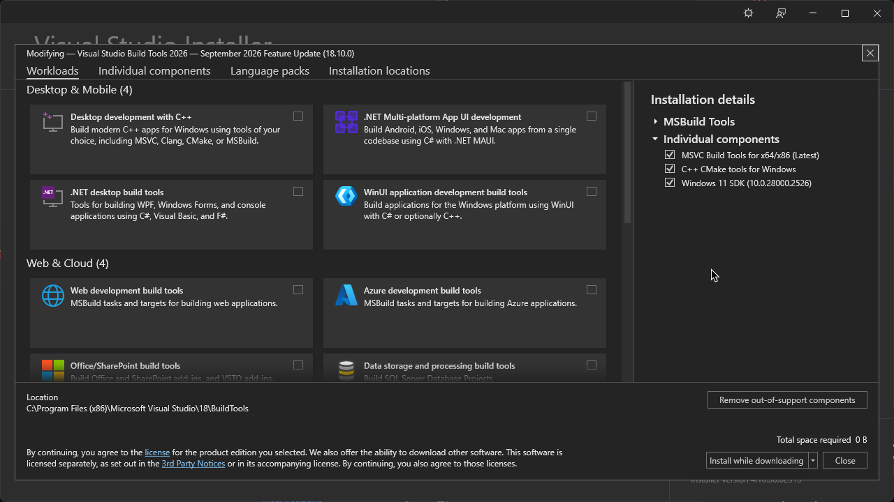

# My Rust Template Project (Windows centric)

## Prerequisites:
- Microsoft Visual C++ (MSVC) Build Tools 18
- Windows 11 SDK
- CMake (optionally for some `crate` that needs it)




To install dependencies:

```batch
cargo install
```

To run:

```batch
cargo run

:: Release
cargo run -r
```

To build:

```batch
cargo build

:: Release
cargo build -r
```

This project was created using [`cargo init`](https://doc.rust-lang.org/cargo/commands/cargo-init.html) in Rust 2024. [**Rust**](https://www.rust-lang.org) is a blazingly fast and memory-efficient low-level programming language.
